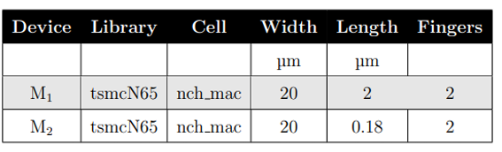

# Table of Contents
- [0.1 Introduction](#01-introduction) 
- [0.2 Description of the Design](#02-description-of-the-design) 
- [0.3 Implementation](#03-implementation)
  - [0.3.1 Unit Cell](#031-unit-cell)
  - [0.3.2 8x8 Unit Cell Array](#032-8x8-unit-cell-array)
  - [0.3.3 Reference Generator](#033-reference-generator)
  - [0.3.4 Decoder](#034-decoder)
  - [0.3.5 Decoder (Additional Circuit)](#035-decoder-additional-circuit)
  - [0.3.6 Final Implementation Of DAC](#036-final-implementation-of-dac)
- [0.4 Parasitic Extraction and Post-Layout Simulation](#04-parasitic-extraction-and-post-layout-simulation)
- [0.5 What is the idea of having the transistors M7 and M8 in the design?](#05-what-is-the-idea-of-having-the-transistors-m7-and-m8-in-the-design)
- [0.6 Reference](#06-reference)

---

## 0.1 Introduction

This project was developed as part of my Master's program in  Integrated Systems and Circuits Design (ISCD) at Carinthia University of Applied Science. It focuses on the design, implementation, and analysis of a 6bit DAC.

The following sections present the project architecture, detailed circuit design, simulation results, and final implementation insights.

 In this lab a 6-bit digital to analog converter is generated. While the input is a digital 6-bit word, the
 analogue output is represented by a variable current. Main parts of the design are:
 - A unit cell which generates either a current of 1 µA or 0 µA
 - A 6bit thermometer decoder

The main objectives are to understand the design principles of a DAC, generatea hierarchical schematic, verify the functionality of the design through simulations, draw a compact hierarchical layout that is LVS clean and free of DRC errors, and performparasitic extraction to verify functionality with parasitics. The report provides a detailed explanation of the design process and simulation results. The final layout is verified to be free of any errors and the DAC is found to operate as expected. This project providesvaluable insights into the design of DACs and the challenges involved in designing an efficient and reliable circuit.

## 0.2 Description of the Design

A digital to analogue converter (DAC) converts a binary digital word into an analogue value, either a voltage or a current. In our example, the binary word has a length of 6-bit and the minimum step size of the analogue word, which is also called a LSB, will be 1 µA as we are using a current as the analogue signal. Figure 1 shows the top-level schematic of such a DAC During operation the number of unit cells
  

**Fig 1:** Toplevel Schematic of 6bit Digital to Analog Converter

which are turned on are equivalent to the number of 1’s at the output of the decoder. Subsequently the output is the sum of all the unit cells which are turned on As this implementation requires a lot of wiring, it can be simplified by arranging the unit cells in a matrix of 8x8 cells and select them by a row- and a column-decoder, each 3bit binary to 7bit thermometer. The output of a 3 to 7 binary to thermometer decoder is according to Table 1.

 
**Table 1:** 3bit Binary to 7bit Thermometer Decoder

which are turned on are equivalent to the number of 1’s at the output of the decoder. Subsequently the output is the sum of all the unit cells which are turned on As this implementation requires a lot of wiring, it can be simplified by arranging the unit cells in a matrix of 8x8 cells and select them by a row- and a column-decoder, each 3bit binary to 7bit thermometer. The output of a 3 to 7 binary to thermometer decoder is according to table 1.

Figure 3 shows the new top-level design with the 8x8 matrix of unit cells and the two decoders.The operation is as following: with the column decoder the first 7bits of a the first row are individually selected. For bit 8 the complete row will be selected by the row decoder, all bits of the column decoder are set to 0 again. This procedure is repeated until all 7 rows are selected. The remaining 7bits are again individually selected by the column decoder.As this scheme uses only 63 of the 64 cells, the remaining cell can be used as a reference diode for the current mirror. Implementation will be shown later in the
description of the circuits.

**Fig 2:** Modified Schematic of 6bit Digital to Analog Converter

## 0.3 Implementation
The schematic,symbol and layout for the following modules has been created separately and made LVS and DRC clean.
 - Unit Cell
 - 8x8 Unit cell array
 - Reference Generator
 - Column Decoder
 - Row Decoder
 - Decoder (Additional Circuit)

### 0.3.1 Unit Cell

The basic structure of the unit cell can be seen in figure 6. A unit cell in this design is to generate 1 µA current.The Unit cell symbol is seen in figure 4. The dimensions of the individual transistors can be found in table 2. While the bulk of all nmos transistors should be connected to ground, bulk of pmos transistors has to be connected to vdd!

### Tset Bench and Simulation
Initially, the functionality of the unit cell schematic is verified using the current reference generator with the setup shown in Figure 7 below. The functionality verification of the unit cell is performed using transient analysis by checking the current (Iout) mirrored in the unit cell when the on, selRow, and selCell Signals, kept as (011) respectively and observed that it has generated a current of 1 µA as shown in Figure 8.
- VDC =1.2 V.
- IDC = 2 µA.
  

**Fig 3:** Unit Cell Symbol

**Table 2:** Parameters of Transistors in Unit Cell

**Fig 4:** Transistor Level Schematic of Unit Cell

**Fig 5:** Unit Cell Test Bench

**Fig 6:** Transient Response of unit cell

**Fig 7:** Unit Cell Layout

### 0.3.2 8x8 Unit Cell Array

A total of 63 current-mirrored unit cells that are arranged in an 8 by 8 matrix, with each generating a current of 1uA. The symbol, schematic, and layout of the unit cell are shown in Figures numbered 5, 6, and 7 below. The number of unit cells that turn on depends on the decimal equivalent of the 6-bit digital code provided at the input of the row and column decoders. The unit cells have to be matched among themselves and the current reference generator in layout for accurate mirroring of current into the unit cells. The matching is the reason for including the current reference generator in the matrix of unit cells, as shown in Figures numbered 8, 9, and 10.

**Fig 8:** Schematic of the 8 by 8 unit cell matrix

**Fig 9:** Symbol of the 8 by 8 unit cell matrix

### 0.3.3 Reference Generator

A current reference generator that serves as an input to the 8 by 8 matrix of unit cells. This reference generator is included in the 8 by 8 matrix to mirror the current of the reference generator into the unit cells. The reference current is supplied from an external source to the reference generator. The reference voltages vb and vc (biasing voltage) are generated by a simple circuit like depicted in figure 10.

**Fig 10:** Transistor Level Schematic of Reference Generator

The dimensions of the individual transistors for this design can be found in table 3. The bulk of all transistors should be connected to ground.
Note: By injection of the reference current Iin two voltages vc and vb are generated, which have to be connected to the voltages vc and vb of the Unit Cell. As the connection for Iin and vc are physically the same net, you have to decide for one of those nets as pin and connect the circuit accordingly, which means either you choose vc and inject the current into that node or you choose Iin and connect this pin to vc of the Unit Cell.

**Table 3:** Parameters of Devices in Reference Generator

Reference generator symbol and layout is shown in figures 11 and 12 respectively.

**Fig 11:** Reference Generator symbol

**Fig 12:** Reference Generator Layout

### 0.3.4 Decoder

A 3 to 8 Row Decoder and a 3 to 8 column decoder to select the unit cells in the desired row and column of the matrix, respectively. The digital code is provided as input to the decoders, and the outputs are passed to the unit cell matrix through the decoder logic.The two decoders for row- and column-selection are the same and perform 3-bit binary to-thermometer decoding according to table 1. A possible implementation can be seen in figure 14. Since both decoder are similar only row decoder schematic, symbol and layouts are going to be mentioned.

**Fig 13:** Schematic of a 3-bit Binary to Thermometer Decoder(Row/Column decoder)

The logical gates used in this design are according to Table 4.

**Table 4:** Schematic of a 3-bit Binary to Thermometer Decoder(Row/Column decoder)

**Fig 14:** Layout of 3-bit Binary to Thermometer Decoder(Row/Column decoder)

### 0.3.5 Decoder (Additional Circuit)

_Explain the additional Decoder circuit here._

---

### 0.3.6 Final Implementation Of DAC

_Explain the final implementation here._

---

## 0.4 Parasitic Extraction and Post-Layout Simulation

_Write about parasitic extraction and post-layout simulation here._

---

## 0.5 What is the idea of having the transistors M7 and M8 in the design?

_Explain why M7 and M8 are needed in your design._

---

## 0.6 Reference

_List your references here._

---
